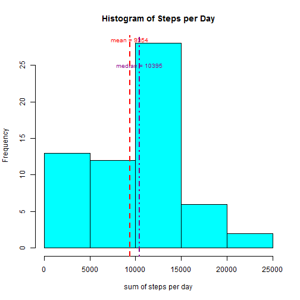
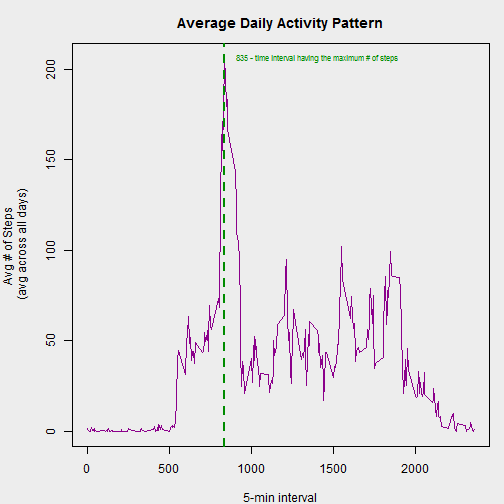
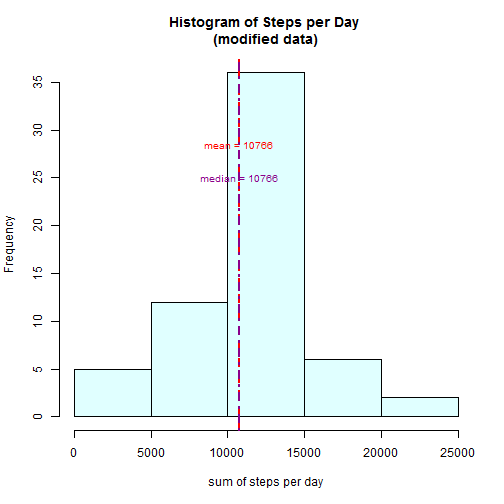

**Peer Assessment 1**  
=====================


### **Loading and preprocessing the data**  


```r
# make sure the data set is in the working directory

a_m_data <- read.csv("activity.csv",stringsAsFactors = FALSE, header = TRUE,sep = ",") # a_m_data is "activity monitoring data"
head(a_m_data)
```

```
##   steps       date interval
## 1    NA 2012-10-01        0
## 2    NA 2012-10-01        5
## 3    NA 2012-10-01       10
## 4    NA 2012-10-01       15
## 5    NA 2012-10-01       20
## 6    NA 2012-10-01       25
```

```r
dim(a_m_data)
```

```
## [1] 17568     3
```

```r
classes <- sapply(a_m_data, class)
classes
```

```
##       steps        date    interval 
##   "integer" "character"   "integer"
```

```r
# the class of all data objects are good, and need not be transformed at this point
```


### **What is mean total number of steps taken per day?**  

1. **Calculating the total number of steps taken per day** (tspd)  


```r
tspd <- tapply(a_m_data$steps, a_m_data$date, sum, na.rm = T)
head(tspd)
```

```
## 2012-10-01 2012-10-02 2012-10-03 2012-10-04 2012-10-05 2012-10-06 
##          0        126      11352      12116      13294      15420
```

2. **Plotting a histogram of the total number of steps per day**  

Difference between histogram and a barplot:  
Histogram - they are used to present "continuous data", that is data that represents measured quantity where, at least in theory, the numbers can take on any value in a certain range. A good example is weight. If you measure the weights of a group of adults you might get and numbers between say 80 pounds and 270 pounds.    
Barplot - used to display "categorical data", that is data that fits into categories.  


```r
hist(tspd, xlab = "sum of steps per day", main = "Histogram of Steps per Day",
     col = "cyan")
abline(v = mean(tspd), lwd = 2,lty = 2, col = "red")
text(mean(tspd),28.5, "mean = 9354", cex = 0.8, col = "red")
abline(v = median(tspd), lwd = 2,lty = 4, col = "darkmagenta")
text(median(tspd),25, "median = 10395", cex = 0.8, col = "darkmagenta")
```

 

3. **Calculating the mean and median of the total number of steps taken per day**  


```r
mean_tspd <- round(mean(tspd))
median_tspd <- round(median(tspd))
```

The mean of the total number of steps taken per day is **9354**, and the median is **1.0395 &times; 10<sup>4</sup>**.

### **What is the Average Daily Activity Pattern ?**  

Average Daily Activity Pattern (adap) - Below plot reflects the average number of steps taken for subsequent day 5-minute intervals, averaged across all days.  


```r
par(mar = c(4, 5, 3, 1), bg = "gray93")
adap <- tapply(a_m_data$steps, a_m_data$interval, mean, na.rm=T)
plot(adap ~ unique(a_m_data$interval), type="l", xlab = "5-min interval",
     ylab = "Avg # of Steps \n(avg across all days)", col = "darkmagenta",
     main = "Average Daily Activity Pattern")
abline(v = 835, lwd = 2, lty = 2, col = "green4")
text(1400, 206, "835 - time interval having the maximum # of steps", 
     cex = 0.7, col = "green4")
```

 


```r
max_ns <- adap[which.max(adap)]
max_ns
```

```
##      835 
## 206.1698
```
The 5-minute interval, on average across all days in the dataset, that contains the maximum number of steps is **835**  

### **Imputing missing values**  

1. **Calculating the total number of missing values in the dataset**   


```r
table(is.na(a_m_data) == TRUE)
```

```
## 
## FALSE  TRUE 
## 50400  2304
```

2. **Devising a strategy for filling in all of the missing values in the dataset**    

Checking to see which columns in the data set have NA values.  

```r
summary(a_m_data)
```

```
##      steps            date              interval     
##  Min.   :  0.00   Length:17568       Min.   :   0.0  
##  1st Qu.:  0.00   Class :character   1st Qu.: 588.8  
##  Median :  0.00   Mode  :character   Median :1177.5  
##  Mean   : 37.38                      Mean   :1177.5  
##  3rd Qu.: 12.00                      3rd Qu.:1766.2  
##  Max.   :806.00                      Max.   :2355.0  
##  NA's   :2304
```

It indicates that only the **steps** column has NA data - 2304 of them.  

**Strategy** - All the NA values within the **steps** variable will be replaced by their corresponding **mean of steps** information, found in the **adap** data set above.  

3. **Creating a new dataset**  


```r
a_m_data2 <- a_m_data  # creation of the dataset that will have no more NAs
for (i in 1:nrow(a_m_data)){
    if(is.na(a_m_data$steps[i])){
        a_m_data2$steps[i]<- adap[[as.character(a_m_data[i, "interval"])]]
    }
}
head(a_m_data2)
```

```
##       steps       date interval
## 1 1.7169811 2012-10-01        0
## 2 0.3396226 2012-10-01        5
## 3 0.1320755 2012-10-01       10
## 4 0.1509434 2012-10-01       15
## 5 0.0754717 2012-10-01       20
## 6 2.0943396 2012-10-01       25
```

```r
summary(a_m_data2)
```

```
##      steps            date              interval     
##  Min.   :  0.00   Length:17568       Min.   :   0.0  
##  1st Qu.:  0.00   Class :character   1st Qu.: 588.8  
##  Median :  0.00   Mode  :character   Median :1177.5  
##  Mean   : 37.38                      Mean   :1177.5  
##  3rd Qu.: 27.00                      3rd Qu.:1766.2  
##  Max.   :806.00                      Max.   :2355.0
```

The **summary** indicates that there are no more NA values.  

4. **Using the new dataset to create a new histogram**  


```r
tspd2 <- tapply(a_m_data2$steps, a_m_data2$date, sum, na.rm = T)
hist(tspd2, xlab = "sum of steps per day", 
     main = "Histogram of Steps per Day \n(modified data)", col = "lightcyan")
abline(v = mean(tspd2), lwd = 2,lty = 2, col = "red")
text(mean(tspd2),28.5, "mean = 10766", cex = 0.8, col = "red")
abline(v = median(tspd2), lwd = 2,lty = 4, col = "darkmagenta")
text(median(tspd2),25, "median = 10766", cex = 0.8, col = "darkmagenta")
```

 


```r
mean_tspd2 <- round(mean(tspd2))
median_tspd2 <- round(median(tspd2))
```

For the new dataset - the mean of the total number of steps taken per day is **1.0766 &times; 10<sup>4</sup>** and the median is **1.0766 &times; 10<sup>4</sup>**.  


```r
a_m_data_summary <- rbind(data.frame(mean = c(mean_tspd, mean_tspd2), median = c(median_tspd, median_tspd2)))
rownames(a_m_data_summary) <- c("a_m_data (with NA's)", "a_m_data2 (without NA's)")
print(a_m_data_summary)
```

```
##                           mean median
## a_m_data (with NA's)      9354  10395
## a_m_data2 (without NA's) 10766  10766
```

As indicated from above summary table, the values for the median and the mean are different for the two datasets. Based on the strategy used for populating the NA values, the resulting mean and median values increased.  

### **Are there differences in activity patterns between weekdays and weekends?**  

1. **Creating a new factor variable in the dataset with two levels - "weekday" and "weekend" indicating whether a given date is a weekday or weekend day**  


```r
a_m_data2$weekday <- c("weekday")
a_m_data2[weekdays(as.Date(a_m_data2[, 2])) 
          %in% c("Saturday", "Sunday"), ][4] <- c("weekend")
head(a_m_data2)
```

```
##       steps       date interval weekday
## 1 1.7169811 2012-10-01        0 weekday
## 2 0.3396226 2012-10-01        5 weekday
## 3 0.1320755 2012-10-01       10 weekday
## 4 0.1509434 2012-10-01       15 weekday
## 5 0.0754717 2012-10-01       20 weekday
## 6 2.0943396 2012-10-01       25 weekday
```

```r
table(a_m_data2$weekday == "weekend")
```

```
## 
## FALSE  TRUE 
## 12960  4608
```

```r
a_m_data2$weekday <- factor(a_m_data2$weekday)
```

Creating a new dataframe in order to visualize the difference between weekdays and weekends.  


```r
a_m_data2_weekend <- subset(a_m_data2, a_m_data2$weekday == "weekend")
a_m_data2_weekday <- subset(a_m_data2, a_m_data2$weekday == "weekday")

mean_a_m_data2_weekday <- tapply(a_m_data2_weekday$steps, 
                                 a_m_data2_weekday$interval, mean)
mean_a_m_data2_weekend <- tapply(a_m_data2_weekend$steps, 
                                 a_m_data2_weekend$interval, mean)
```

2. **Making a panel plot containing a time series plot (i.e. type = "l") of the 5-minute interval (x-axis) and the average number of steps taken, averaged across all weekday days or weekend days (y-axis)**  


```r
library(lattice)
df_weekday <- data.frame(interval = unique(a_m_data2_weekday$interval), 
                         avg = as.numeric(mean_a_m_data2_weekday), 
                         day = rep("weekday", length(mean_a_m_data2_weekday)))
df_weekend <- data.frame(interval = unique(a_m_data2_weekend$interval), 
                         avg = as.numeric(mean_a_m_data2_weekend), 
                         day = rep("weekend", length(mean_a_m_data2_weekend)))
df_final <- rbind(df_weekday, df_weekend)

xyplot(avg ~ interval | day, data = df_final, layout = c(1, 2), 
       type = "l", ylab = "Number of steps")
```

 
